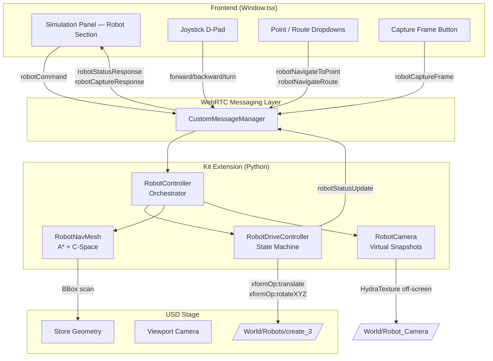
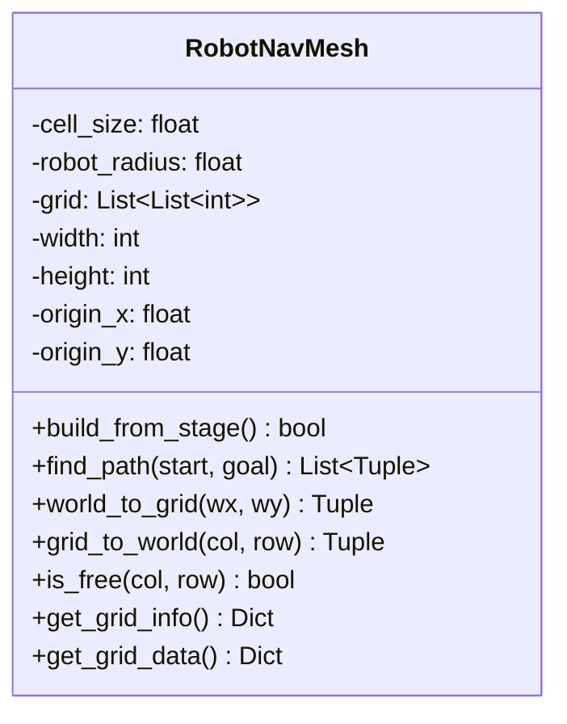
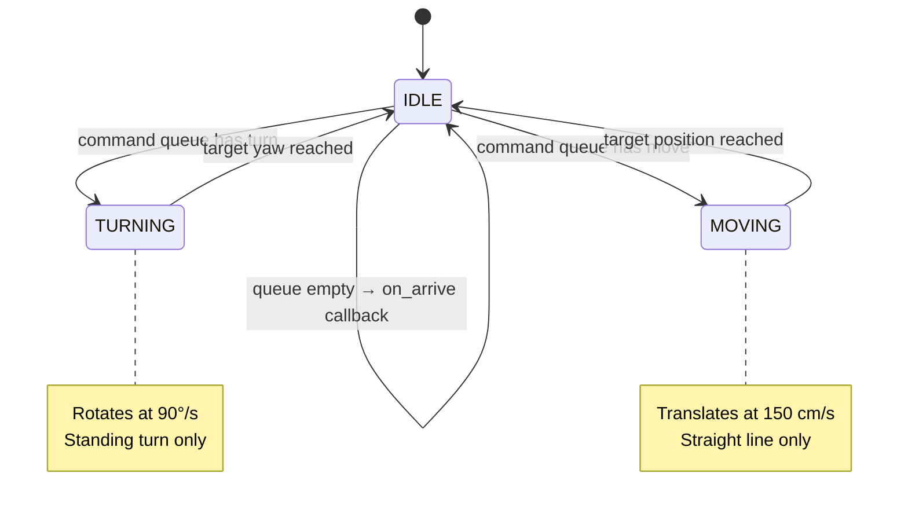
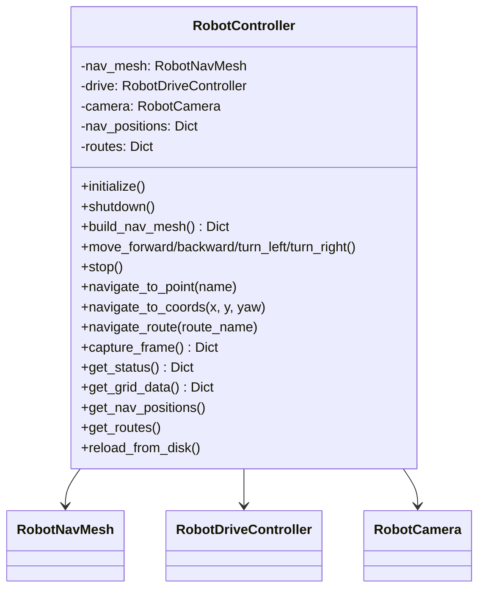
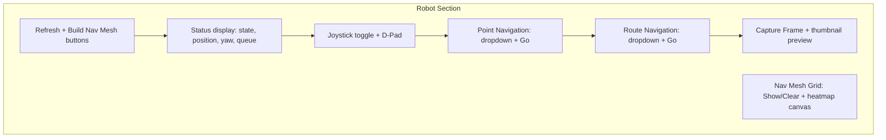
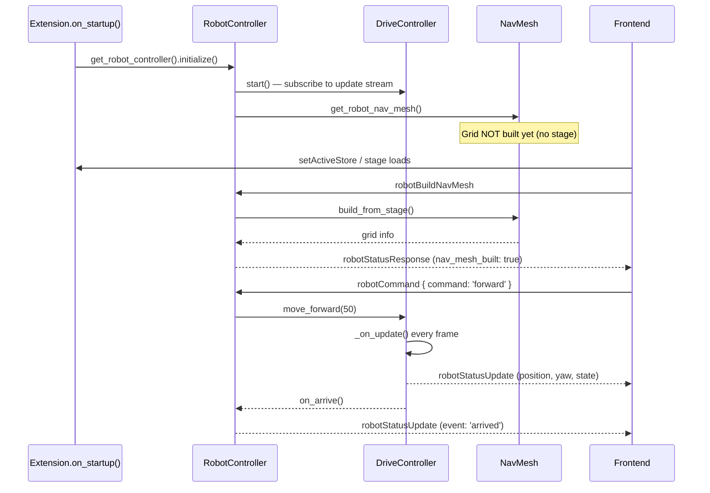

# V1 Robot Implementation — Clearpath Dingo

## Overview

A movable robot (Clearpath Dingo) is integrated into the 7-Eleven virtual store running on Omniverse Kit-App-Template USD Viewer in streaming mode. The robot navigates the store realistically using a 2D occupancy grid with A* pathfinding, avoids obstacles via C-Space inflation, and provides a virtual camera for taking snapshots.

**Robot prim:** `/World/Robots/create_3`

---

## Architecture



---

## Module Breakdown

### 1. `robot_nav_mesh.py` — Navigation Plane



**Responsibilities:**
- Scans `/World` children for obstacle geometry (Mesh/Xform prims)
- Rasterizes obstacle bounding boxes into a 2D grid (**XY ground plane, Z-up**)
- Uses `/World/Floor` mesh bounding box for grid extents (falls back to `/World` root)
- Applies **C-Space inflation** — expands obstacles by the robot radius so the path planner treats the robot as a point
- **A\* pathfinding** on the 4-connected grid (straight moves only)
- Path simplification removes collinear waypoints
- `get_grid_data()` returns the grid as a flat string (one char per cell) for frontend heatmap visualization (downsampled to max ~80 cells per side, well under WebRTC 64KB limit)

**Configuration:**
| Parameter | Default | Description |
|---|---|---|
| `cell_size` | 10.0 cm | Grid resolution |
| `robot_radius` | 30.0 cm | Inflation radius |
| `floor_z` | 0.0 | Floor plane Z coordinate (Z-up store) |
| `scan_height` | 500.0 cm | Only geometry in [floor_z, floor_z+50] is rasterized |

### 2. `robot_drive_controller.py` — State Machine



**Responsibilities:**
- Subscribes to Kit's **update event stream** (`get_app().get_update_event_stream()`) — no `asyncio.sleep()`
- Every frame: reads `dt` from the event, advances the state machine
- Commands are queued: `[turn, move, turn, move, ...]`
- Coordinate navigation decomposes into turn→move→turn sequences via A*

**Key API:**
```python
controller.move_forward(distance=50.0)
controller.move_backward(distance=50.0)
controller.turn_left(degrees=90.0)
controller.turn_right(degrees=90.0)
controller.navigate_to(x, y, target_yaw=None)
controller.stop()
```

### 3. `robot_camera.py` — Virtual Camera

**How it works:**
1. Creates a dedicated `/World/Robot_Camera` USD camera prim (hidden from the user's viewport)
2. Computes the robot's "eye" position using `camera_height_cm` custom attribute on the robot xForm (falls back to `ROBOT_CAMERA_HEIGHT` = 50 cm) + `ROBOT_CAMERA_FORWARD` in front
3. Camera rotation uses `rotateXYZ(80, 0, yaw - 90)`: after the 80° X rotation the camera looks along +Y, so subtracting 90° aligns it with the robot's forward direction (+X at yaw=0)
4. Uses **HydraTexture** off-screen rendering (same pattern as `cctv_capture.py`) — no viewport disruption
5. Reads pixels via `omni.renderer_capture` from the `LdrColor` AOV
6. Downscales to a JPEG thumbnail (250px wide, quality 50)

### 4. `robot_controller.py` — Orchestrator



**Persistence:**
- Robot nav positions and routes are read from the **existing** `nav_presets.json` / `nav_routes.json` used by the camera navigation system
- Only entries whose key starts with `robot_` are loaded
- The `rotation[2]` (rz) field from the nav preset is used as yaw (rotation around Z in the Z-up store)

---

## Message Protocol

### Frontend → Kit

| Event Type | Payload | Description |
|---|---|---|
| `robotCommand` | `{ command, distance?, degrees? }` | Direct input: `forward`, `backward`, `turn_left`, `turn_right` |
| `robotStop` | `{}` | Emergency stop — clears all queued commands |
| `robotNavigateToPoint` | `{ name }` | Navigate to a saved `robot_*` nav point |
| `robotNavigateRoute` | `{ name }` | Execute a saved route sequentially |
| `robotGetStatus` | `{}` | Request current robot state |
| `robotBuildNavMesh` | `{}` | Build/rebuild the occupancy grid from the USD stage |
| `robotCaptureFrame` | `{ width?, quality? }` | Capture a snapshot from the robot's virtual camera |
| `robotGetNavPositions` | `{}` | Fetch all robot_* nav positions |
| `robotGetRoutes` | `{}` | Fetch all robot_* routes |
| `robotGetGridData` | `{}` | Fetch nav mesh grid data for visualization |

### Kit → Frontend

| Event Type | Payload | Description |
|---|---|---|
| `robotStatusResponse` | `{ initialized, state, is_idle, queue_length, position, yaw, camera_position, nav_mesh_built }` | Full status snapshot |
| `robotStatusUpdate` | `{ event, position, yaw, state }` | Periodic update while robot is moving |
| `robotCommandResponse` | `{ ok, command, ... }` | Acknowledgement for direct commands |
| `robotNavPositionsResponse` | `{ positions: {...} }` | Updated nav positions list |
| `robotRoutesResponse` | `{ routes: {...} }` | Updated routes list |
| `robotCaptureResponse` | `{ ok, frame?, error? }` | Base64 JPEG thumbnail from robot camera |
| `robotGridDataResponse` | `{ flat, width, height, cell_size, origin_x, origin_y, step }` | Nav mesh grid data (flat string encoding) |

---

## Frontend UI

The **Simulation Panel** gains a new "🤖 Robot (Dingo)" section with:



### Joystick

- **Toggle On** activates the D-Pad and refreshes robot status
- **D-Pad buttons** fire `robotCommand` messages on press-and-hold (200ms repeat)
  - ▲ Forward (30 cm steps)
  - ▼ Backward (30 cm steps)
  - ◄ Turn Left (15° steps)
  - ► Turn Right (15° steps)
- **Toggle Off** sends `robotStop` to halt the robot
- Center **STOP** button provides emergency stop

---

## Initialization Flow



---

## Files Changed / Created

### New Files
| File | Purpose |
|---|---|
| `robot_nav_mesh.py` | 2D occupancy grid, C-Space inflation, A* pathfinding |
| `robot_drive_controller.py` | Event-stream state machine (IDLE→TURNING→MOVING) |
| `robot_camera.py` | Virtual camera snapshots from robot POV |
| `robot_controller.py` | Orchestrator wiring nav mesh + drive + camera |

### Modified Files
| File | Changes |
|---|---|
| `extension.py` | Import `get_robot_controller`, initialize on startup, shutdown on cleanup |
| `custom_messaging.py` | 12 new incoming robot message handlers, 6 new outgoing event types, robot status push callback |
| `Window.tsx` | Robot state in `AppState`, 6 new event handlers, robot methods + joystick logic, Robot UI section in Simulation panel |

---

## Design Decisions

1. **No Action Graph** — The robot is moved purely via `xformOp:translate` and `xformOp:rotateXYZ` on the prim, driven by the Kit update event stream.

2. **Event stream instead of asyncio.sleep()** — The `RobotDriveController` subscribes to `get_app().get_update_event_stream()` and uses frame `dt` for smooth, lag-resilient animation.

3. **Straight-line movement only** — The robot does not curve. Navigation is decomposed into standing turns + straight drives. This keeps the state machine simple and predictable.

4. **C-Space inflation** — Obstacles are expanded by the robot's bounding radius before pathfinding, guaranteeing no part of the robot collides with shelves/walls.

5. **Off-screen HydraTexture camera** — A hidden `/World/Robot_Camera` prim is rendered off-screen via `omni.kit.hydra_texture`. The camera rotation uses `rotateXYZ(80, 0, yaw - 90)`: after the 80° X rotation the camera looks along +Y, so subtracting 90° from yaw aligns it with the robot's forward direction (+X at yaw=0). No viewport fallback is used.

6. **Joystick press-and-hold** — Uses `setInterval` with 200ms repeat for smooth continuous input. Each tap sends a small step (30cm / 15°) to keep movement responsive without idle gaps between commands.

7. **Local coordinate consistency** — The drive controller reads and writes LOCAL xform ops exclusively. Both `_begin_next_command` and the tick functions use `rotate_op.Get()` / `translate_op.Get()`, ensuring target values and progress checks are always in the same coordinate space regardless of parent transforms.

8. **Grid data encoding** — The nav mesh grid is sent to the frontend as a flat string (one character per cell: `'0'`=free, `'1'`=obstacle, `'2'`=inflated) instead of a nested JSON array. This keeps the payload well under the WebRTC 64KB message limit even for large grids.

9. **Refresh reloads from disk** — When the frontend requests nav positions or routes, the backend calls `reload_from_disk()` which re-reads `nav_presets.json` and `nav_routes.json` from the camera navigation module before returning results. This ensures external edits are immediately picked up.

10. **Yaw convention: robot model faces +X at rz=0** — The Clearpath Dingo mesh is authored facing +X at identity rotation. `atan2(dy, dx)` returns 0° for the +X direction, so heading math needs **no offset**: `desired_yaw = atan2(dy, dx)` and `movement_rad = radians(yaw)` both work directly. The same-point guard (distance < 5 cm) prevents spurious rotations when navigating to the robot's current position.

11. **Nav preset camera→robot yaw conversion** — Navigation presets are authored via the camera UI where +Y is forward at rz=0 (camera convention). The robot model faces +X at rz=0. On load, `_load_nav_positions()` and `_load_routes()` add 90° to the stored rz to convert from camera convention to robot convention.

12. **USD row-vector matrix convention** — USD's `GfMatrix4d` uses the row-vector convention (`v' = v * M`). Extracting yaw via `atan2(m[1][0], m[0][0])` gives **-θ** (sign-inverted). Instead, `get_position()` uses `TransformDir(+X)` to transform the robot's forward direction to world space, which handles the convention correctly and returns the true yaw.
