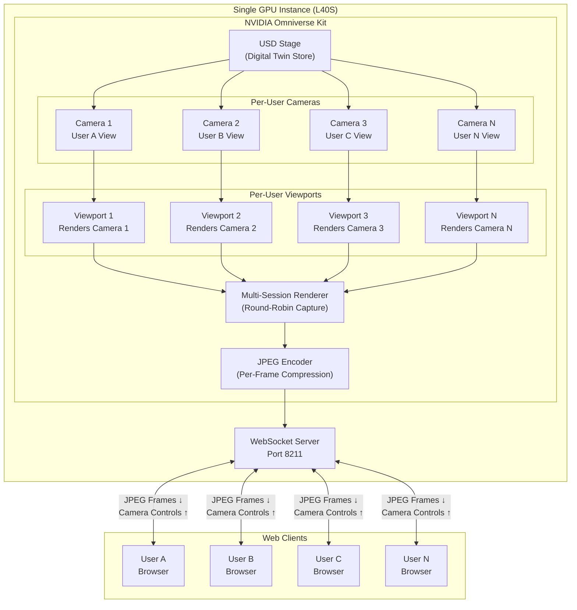
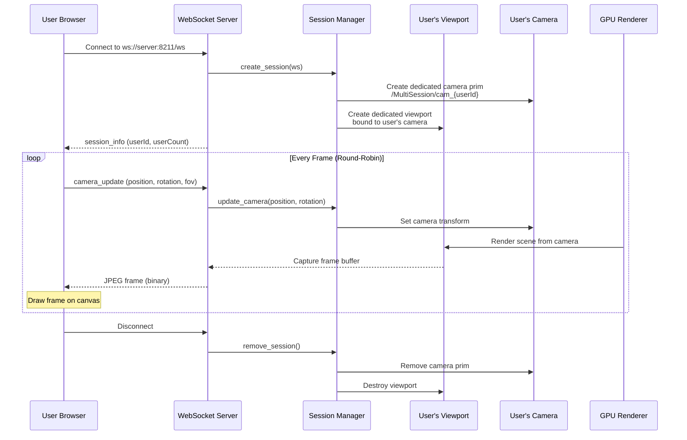
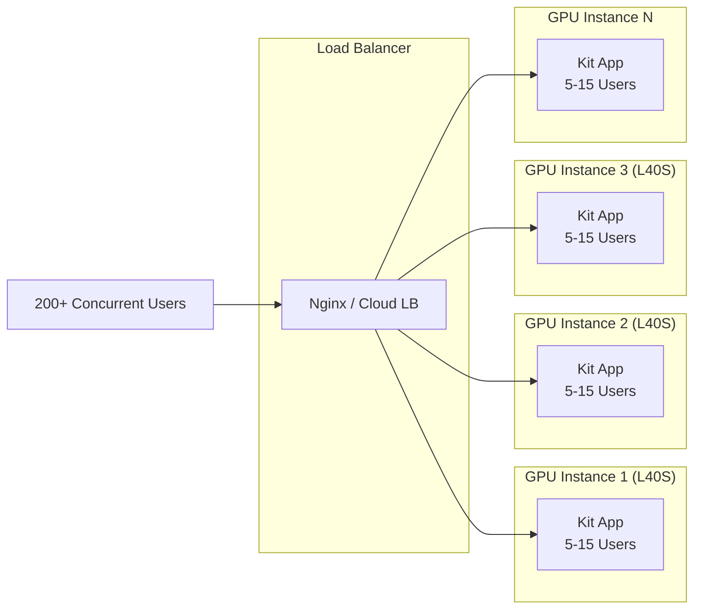
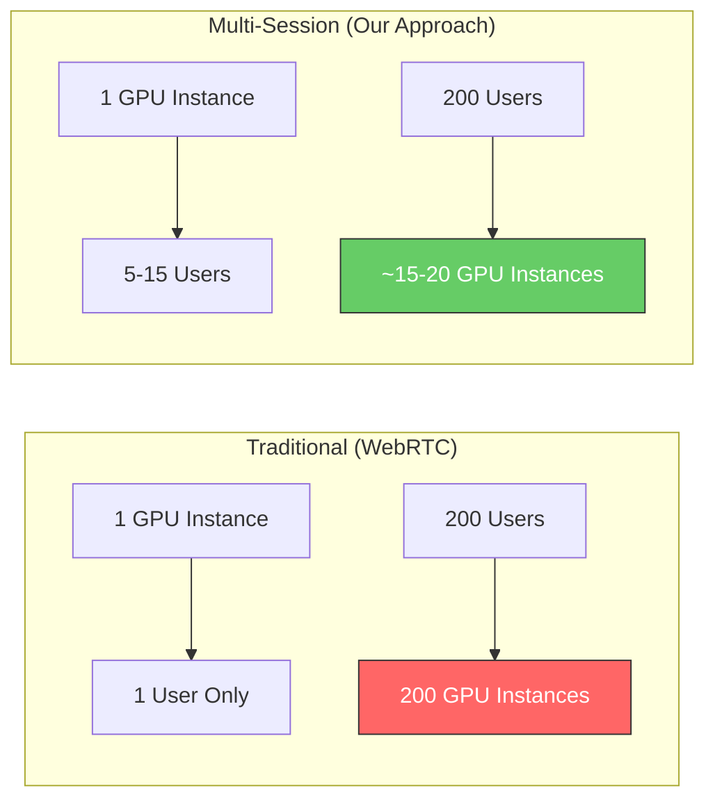

# Multi-Session Streaming Architecture

## System Overview

## Data Flow Per User

## Scaling Architecture

## Key Design Points

| Aspect | Detail |
|--------|--------|
| **Isolation** | Each user gets their own camera + viewport — fully independent navigation |
| **Rendering** | Round-robin capture across viewports — single GPU serves all users |
| **Transport** | JPEG frames over WebSocket — lightweight, no WebRTC complexity |
| **Scaling** | 5-15 users per GPU instance, horizontal scaling via load balancer |
| **FPS** | ~30 fps (1 user), ~10 fps (3 users), ~6 fps (5 users) on L40S |
| **Bandwidth** | ~30-60 KB per frame at 720p JPEG — low network overhead |
| **Latency** | Camera controls computed client-side for instant responsiveness |

## Traditional vs Multi-Session Approach

